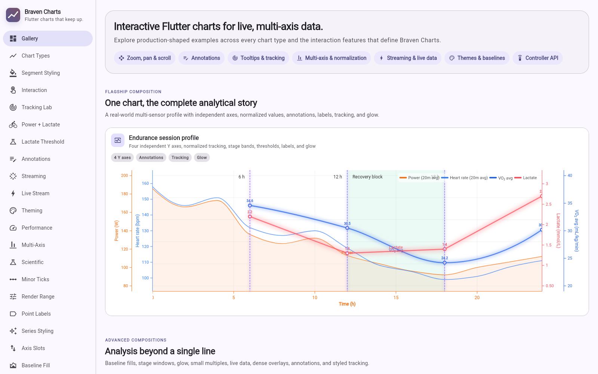

# Braven Charts

[](https://pub.dev/packages/braven_charts)
[](https://flutter.dev)
[](https://github.com/braven-pvm/braven_charts/blob/master/LICENSE)

**Flutter charts that keep up.** Braven Charts is an interactive, web-first
charting package for live data, multi-axis analysis, annotations, and deeply
themeable product experiences.

The package API is exposed through `BravenChartPlus`; the product and project
name is **Braven Charts**.



## Why Braven Charts

| Capability | What it provides |
| --- | --- |
| Interaction | Pointer and touch zoom, pan, X/Y scrollbars, hover tooltips, crosshairs, and tracking panels |
| Data series | Line, area, bar, scatter, mixed-series charts, markers, interpolation, segment styling, and baseline fills |
| Axes | Configurable X axis, multiple independent Y axes, shared axes, automatic or per-series normalization, and visible-axis slots |
| Annotations | Point, range, text, threshold, trend, chord, pin, and legend annotations with interactive editing |
| Live data | Frame-coalesced point ingestion, bounded buffers, follow-latest viewports, pause/resume, and buffered catch-up |
| Presentation | Light/dark and custom themes, legends, labels, loading skeletons, progress indicators, and empty states |
| Application control | Controllers, callbacks, runtime series selection, annotation management, axis-slot state, and serializable chart configuration |
| Portable artifacts | Capture effective chart state, persist canonical JSON, render exact-X data tables with native copy/CSV actions, attach previews, and hydrate fresh interactive charts |

The included showcase turns these capabilities into focused, runnable demos—not
just static screenshots. See [the showcase guide](https://github.com/braven-pvm/braven_charts/blob/master/example/README.md) for the
feature-to-page map.

## Install

Add the package to your app:

```yaml
dependencies:
  braven_charts: ^0.1.0
```

Then fetch dependencies:

```bash
flutter pub get
```

Braven Charts 0.1.0 requires Dart 3.9 or later and Flutter 3.35 or later.

## Quick start

```dart
import 'package:braven_charts/braven_charts.dart';
import 'package:flutter/material.dart';

class RevenueChart extends StatelessWidget {
  const RevenueChart({super.key});

  @override
  Widget build(BuildContext context) {
    return BravenChartPlus(
      title: 'Revenue',
      subtitle: 'Last 6 months',
      series: const [
        LineChartSeries(
          id: 'revenue',
          name: 'Revenue',
          unit: 'USD',
          color: Color(0xFF0F766E),
          interpolation: LineInterpolation.bezier,
          showDataPointMarkers: true,
          points: [
            ChartDataPoint(x: 1, y: 45000),
            ChartDataPoint(x: 2, y: 52000),
            ChartDataPoint(x: 3, y: 49000),
            ChartDataPoint(x: 4, y: 63000),
            ChartDataPoint(x: 5, y: 71000),
            ChartDataPoint(x: 6, y: 68000),
          ],
        ),
      ],
      xAxisConfig: const XAxisConfig(label: 'Month'),
      yAxis: const YAxisConfig(label: 'Revenue', unit: 'USD'),
      interactionConfig: const InteractionConfig(
        crosshair: CrosshairConfig(
          enabled: true,
          mode: CrosshairMode.both,
          snapToDataPoint: true,
          displayMode: CrosshairDisplayMode.tracking,
        ),
        tooltip: TooltipConfig(enabled: true),
      ),
    );
  }
}
```

## Multi-axis and normalization

Attach a `YAxisConfig` directly to each series when measurements use different
units or scales. Braven Charts can normalize each series for a shared plot while
keeping labels, tracking values, and tooltips in their original units.

```dart
BravenChartPlus(
  normalizationMode: NormalizationMode.perSeries,
  series: [
    LineChartSeries(
      id: 'power',
      name: 'Power',
      unit: 'W',
      points: powerPoints,
      yAxisConfig: const YAxisConfig(
        label: 'Power',
        unit: 'W',
        position: YAxisPosition.left,
      ),
    ),
    LineChartSeries(
      id: 'heart-rate',
      name: 'Heart rate',
      unit: 'bpm',
      points: heartRatePoints,
      yAxisConfig: const YAxisConfig(
        label: 'Heart rate',
        unit: 'bpm',
        position: YAxisPosition.right,
      ),
    ),
  ],
)
```

## Loading and empty states

`isLoading` replaces the plot viewport without changing the surrounding layout.
The default is an animated, theme-aware chart skeleton with reduced-motion
support and soft edge fades. Circular, linear, determinate, and fully custom
states are also available.

```dart
BravenChartPlus(
  series: series,
  isLoading: isLoading,
  loadingConfig: const ChartLoadingConfig.skeleton(),
  emptyStateConfig: const ChartEmptyStateConfig(
    title: 'No workout samples',
    message: 'Import a workout or change the selected date range.',
  ),
)
```

Customize only the skeleton characteristics your product needs:

```dart
loadingConfig: const ChartLoadingConfig.skeleton(
  skeletonStyle: ChartLoadingSkeletonStyle(
    seriesColor: Color(0xFF6D28D9),
    secondarySeriesColor: Color(0xFFEC4899),
    animationDuration: Duration(milliseconds: 1800),
    motionIntensity: 0.8,
    edgeFadeFraction: 0.16,
  ),
),
```

## Live data

`LiveStreamController` accepts individual or batched points without rebuilding
the chart widget for every sample. It exposes pause/resume state, buffered point
counts, bounds, the latest point, and a snapshot of the active buffer.

```dart
final liveController = LiveStreamController(
  seriesId: 'sensor',
  maxPoints: 1000,
);

liveController.addPoint(
  ChartDataPoint(
    x: DateTime.now().millisecondsSinceEpoch.toDouble(),
    y: sensorReading,
  ),
);

BravenChartPlus(
  series: const [
    LineChartSeries(
      id: 'sensor',
      name: 'Sensor',
      points: [],
    ),
  ],
  liveStreamController: liveController,
)
```

Dispose controllers you create when the owning widget is disposed.

## Programmatic control

The package provides focused controller APIs rather than requiring access to
rendering internals:

- `BravenChartController` selects series and exposes visible/overflow Y-axis
  slots.
- `ChartController` manages runtime point collections and annotations.
- `AnnotationController` coordinates interactive annotation workflows.
- `StreamingController` and `LiveStreamController` control viewport and live
  ingestion state.
- `ChartConfigBuilder` and the agent interface support serializable,
  tool-driven chart construction.

See [Public API overview](https://github.com/braven-pvm/braven_charts/blob/master/doc/api_reference.md) for the exported surface and
the API documentation generated by pub.dev for member-level reference.

## Portable chart artifacts

Capture a mounted chart once and reuse the same effective state for storage,
sharing, previews, data tables, or a restored interactive copy. Artifacts are
validated, deterministic, schema-versioned, and safe by construction: JSON
contains descriptors rather than executable callbacks or class names.

```dart
final result = await chartController.extractArtifact(
  const ChartArtifactExtractOptions(
    includePreview: true,
    documentOptions: ChartDocumentExtractOptions(
      dataStorage: ChartDataStorage.inlineColumns,
    ),
  ),
);

if (result case ChartArtifactSuccess<ChartArtifact>()) {
  final json = ChartArtifactJsonCodec.encode(result.value);
  // Persist json.value when encoding succeeds; inspect warnings as needed.
}
```

`ChartDataTable` includes bounded whole-dataset clipboard copy, per-row copy,
and raw-value CSV export. Web builds download CSV directly; non-web hosts can
provide delivery callbacks for their file or share-sheet workflow.

For the complete capture, table, transport, hydration, resolver, migration,
and runtime-binding contracts, read the [portable chart artifact guide](doc/chart_artifacts.md).

## Run the showcase

```bash
cd example
flutter pub get
flutter run -d chrome
```

The showcase is responsive: desktop uses a persistent feature rail, while
smaller screens use a navigation drawer. It includes gallery-ready examples and
focused labs for chart types, interaction, tracking, annotations, streaming,
theming, performance, multi-axis layouts, scientific data, baseline fills, and
state UX.

## Documentation

- [Showcase and examples](https://github.com/braven-pvm/braven_charts/blob/master/example/README.md)
- [Public API overview](https://github.com/braven-pvm/braven_charts/blob/master/doc/api_reference.md)
- [Portable chart artifacts](https://github.com/braven-pvm/braven_charts/blob/master/doc/chart_artifacts.md)
- [Feature coverage matrix](https://github.com/braven-pvm/braven_charts/blob/master/doc/feature_matrix.md)
- [Release and publishing checklist](https://github.com/braven-pvm/braven_charts/blob/master/doc/release_checklist.md)
- [Changelog](https://github.com/braven-pvm/braven_charts/blob/master/CHANGELOG.md)
- [Contributing](https://github.com/braven-pvm/braven_charts/blob/master/CONTRIBUTING.md)

Pub.dev generates and hosts member-level API documentation from the package's
`///` documentation comments for every published version.

## License

Braven Charts is available under the [MIT License](https://github.com/braven-pvm/braven_charts/blob/master/LICENSE).
