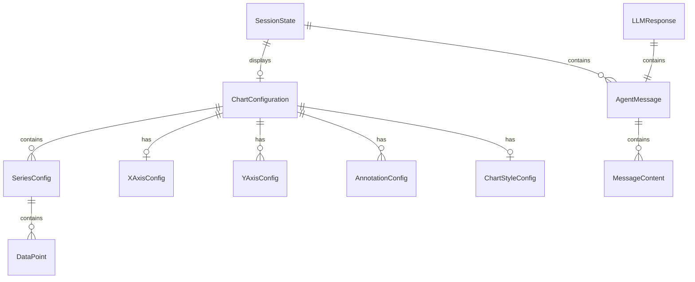

# Data Model: Braven Agent Package

**Feature**: 004-braven-agent-package  
**Date**: 2026-01-28  
**Status**: Complete

## Overview

This document defines all data models for the `braven_agent` package. Models are organized by layer following the technical design.

---

## 1. Model Layer (`lib/src/models/`)

### 1.1 ChartConfiguration

The root model representing a complete chart specification.

```dart
// File: lib/src/models/chart_configuration.dart

class ChartConfiguration with EquatableMixin {
  final String id;                          // UUID
  final ChartType type;
  final String? title;
  final String? subtitle;
  final List<SeriesConfig> series;
  final XAxisConfig? xAxis;
  final List<YAxisConfig> yAxes;
  final List<AnnotationConfig> annotations;
  final ChartStyleConfig? style;
  final bool showGrid;
  final bool showLegend;
  final LegendPosition legendPosition;
  final bool useDarkTheme;
  final bool showScrollbar;
  final NormalizationMode normalizationMode;
  final double? width;
  final double? height;

  const ChartConfiguration({
    required this.id,
    required this.type,
    this.title,
    this.subtitle,
    required this.series,
    this.xAxis,
    this.yAxes = const [],
    this.annotations = const [],
    this.style,
    this.showGrid = true,
    this.showLegend = true,
    this.legendPosition = LegendPosition.bottom,
    this.useDarkTheme = false,
    this.showScrollbar = false,
    this.normalizationMode = NormalizationMode.none,
    this.width,
    this.height,
  });

  // Required by v5.1 spec
  factory ChartConfiguration.fromJson(Map<String, dynamic> json);
  Map<String, dynamic> toJson();
  ChartConfiguration copyWith({...});

  @override
  List<Object?> get props => [id, type, title, subtitle, series, ...];
}

enum ChartType { line, area, bar, scatter }
enum LegendPosition { top, bottom, left, right, topLeft, topRight, bottomLeft, bottomRight }
enum NormalizationMode { none, auto, perSeries }
```

**Constraints:**

- `id` must be valid UUID v4
- `series` must have at least 1 element
- `type` cannot be null

### 1.2 SeriesConfig

Configuration for a single data series.

```dart
// File: lib/src/models/series_config.dart

class SeriesConfig with EquatableMixin {
  final String id;                          // Unique within chart
  final String? name;                       // Display name for legend
  final List<DataPoint> data;               // Required
  final String? color;                      // Hex color (#RRGGBB)
  final double strokeWidth;                 // Default: 2.0
  final List<double>? strokeDash;           // Dash pattern [5, 3]
  final double fillOpacity;                 // 0.0-1.0, default: 0.0
  final MarkerStyle markerStyle;
  final double markerSize;                  // Default: 4.0
  final Interpolation interpolation;
  final double tension;                     // Bezier tension 0.0-1.0
  final bool showPoints;
  final String? yAxisPosition;              // left, right, leftOuter, rightOuter
  final String? yAxisLabel;
  final String? yAxisUnit;
  final String? yAxisColor;
  final double? yAxisMin;
  final double? yAxisMax;

  const SeriesConfig({
    required this.id,
    this.name,
    required this.data,
    this.color,
    this.strokeWidth = 2.0,
    this.strokeDash,
    this.fillOpacity = 0.0,
    this.markerStyle = MarkerStyle.none,
    this.markerSize = 4.0,
    this.interpolation = Interpolation.linear,
    this.tension = 0.4,
    this.showPoints = false,
    this.yAxisPosition,
    this.yAxisLabel,
    this.yAxisUnit,
    this.yAxisColor,
    this.yAxisMin,
    this.yAxisMax,
  });

  factory SeriesConfig.fromJson(Map<String, dynamic> json);
  Map<String, dynamic> toJson();
  SeriesConfig copyWith({...});

  @override
  List<Object?> get props => [id, name, data, color, ...];
}

class DataPoint with EquatableMixin {
  final double x;
  final double y;

  const DataPoint({required this.x, required this.y});

  factory DataPoint.fromJson(Map<String, dynamic> json);
  Map<String, dynamic> toJson();

  @override
  List<Object?> get props => [x, y];
}

enum MarkerStyle { none, circle, square, triangle, diamond }
enum Interpolation { linear, bezier, stepped, monotone }
```

**Constraints:**

- `id` must be unique within parent chart
- `data` must have at least 1 element
- `fillOpacity` clamped to 0.0-1.0
- `strokeWidth` must be positive

### 1.3 XAxisConfig

X-axis configuration.

```dart
// File: lib/src/models/x_axis_config.dart

class XAxisConfig with EquatableMixin {
  final String? label;
  final String? unit;
  final AxisType type;                      // numeric, time, category
  final double? min;
  final double? max;
  final bool autoRange;                     // Default: true
  final double paddingPercent;              // Default: 0.0
  final int? tickCount;                     // Min 2
  final String? tickFormat;
  final double tickRotation;                // Degrees
  final bool showTicks;                     // Default: true
  final bool showAxisLine;                  // Default: true
  final bool showGridLines;                 // Default: true
  final String? gridColor;                  // Hex color
  final List<double>? gridDash;

  const XAxisConfig({
    this.label,
    this.unit,
    this.type = AxisType.numeric,
    this.min,
    this.max,
    this.autoRange = true,
    this.paddingPercent = 0.0,
    this.tickCount,
    this.tickFormat,
    this.tickRotation = 0.0,
    this.showTicks = true,
    this.showAxisLine = true,
    this.showGridLines = true,
    this.gridColor,
    this.gridDash,
  });

  factory XAxisConfig.fromJson(Map<String, dynamic> json);
  Map<String, dynamic> toJson();
  XAxisConfig copyWith({...});

  @override
  List<Object?> get props => [label, unit, type, ...];
}

enum AxisType { numeric, time, category }
```

**Constraints:**

- `tickCount` >= 2 if specified
- `min` < `max` if both specified

### 1.4 YAxisConfig

Y-axis configuration (supports multiple axes).

```dart
// File: lib/src/models/y_axis_config.dart

class YAxisConfig with EquatableMixin {
  final String? id;                         // For multi-axis linking
  final String? label;
  final String? unit;
  final AxisPosition position;              // left, right
  final double? min;
  final double? max;
  final bool autoRange;                     // Default: true
  final bool includeZero;                   // Default: false
  final double paddingPercent;              // Default: 0.0
  final int? tickCount;
  final String? tickFormat;
  final bool showTicks;                     // Default: true
  final bool showAxisLine;                  // Default: true
  final bool showGridLines;                 // Default: true
  final String? gridColor;                  // Hex color
  final String? color;                      // Axis line/label color

  const YAxisConfig({
    this.id,
    this.label,
    this.unit,
    this.position = AxisPosition.left,
    this.min,
    this.max,
    this.autoRange = true,
    this.includeZero = false,
    this.paddingPercent = 0.0,
    this.tickCount,
    this.tickFormat,
    this.showTicks = true,
    this.showAxisLine = true,
    this.showGridLines = true,
    this.gridColor,
    this.color,
  });

  factory YAxisConfig.fromJson(Map<String, dynamic> json);
  Map<String, dynamic> toJson();
  YAxisConfig copyWith({...});

  @override
  List<Object?> get props => [id, label, unit, position, ...];
}

enum AxisPosition { left, right }
```

### 1.5 AnnotationConfig

Chart annotation configuration.

```dart
// File: lib/src/models/annotation_config.dart

class AnnotationConfig with EquatableMixin {
  final AnnotationType type;                // referenceLine, zone, textLabel, marker
  final Orientation? orientation;           // horizontal, vertical
  final double? value;                      // Y-value for horizontal, X for vertical
  final double? minValue;                   // Zone start
  final double? maxValue;                   // Zone end
  final double? x;                          // Marker/label X coordinate
  final double? y;                          // Marker/label Y coordinate
  final AnnotationPosition? position;       // topLeft, center, etc.
  final String? text;                       // Label text
  final String? label;                      // Short label
  final String? color;                      // Hex color
  final double? opacity;                    // 0.0-1.0
  final String? seriesId;                   // For perSeries normalization

  const AnnotationConfig({
    required this.type,
    this.orientation,
    this.value,
    this.minValue,
    this.maxValue,
    this.x,
    this.y,
    this.position,
    this.text,
    this.label,
    this.color,
    this.opacity,
    this.seriesId,
  });

  factory AnnotationConfig.fromJson(Map<String, dynamic> json);
  Map<String, dynamic> toJson();
  AnnotationConfig copyWith({...});

  @override
  List<Object?> get props => [type, orientation, value, ...];
}

enum AnnotationType { referenceLine, zone, textLabel, marker }
enum Orientation { horizontal, vertical }
enum AnnotationPosition {
  topLeft, topCenter, topRight,
  centerLeft, center, centerRight,
  bottomLeft, bottomCenter, bottomRight
}
```

**Constraints:**

- `referenceLine` requires `orientation` and `value`
- `zone` requires `minValue` and `maxValue`
- `textLabel` requires `text`

### 1.6 ChartStyleConfig

Chart styling configuration.

```dart
// File: lib/src/models/chart_style_config.dart

class ChartStyleConfig with EquatableMixin {
  final String? backgroundColor;            // Hex color
  final String? gridColor;
  final String? axisColor;
  final String? fontFamily;
  final double? fontSize;
  final double? paddingTop;
  final double? paddingBottom;
  final double? paddingLeft;
  final double? paddingRight;

  const ChartStyleConfig({
    this.backgroundColor,
    this.gridColor,
    this.axisColor,
    this.fontFamily,
    this.fontSize,
    this.paddingTop,
    this.paddingBottom,
    this.paddingLeft,
    this.paddingRight,
  });

  factory ChartStyleConfig.fromJson(Map<String, dynamic> json);
  Map<String, dynamic> toJson();
  ChartStyleConfig copyWith({...});

  @override
  List<Object?> get props => [backgroundColor, gridColor, ...];
}
```

---

## 2. LLM Layer (`lib/src/llm/`)

### 2.1 AgentMessage

Message in a conversation.

```dart
// File: lib/src/llm/agent_message.dart

class AgentMessage with EquatableMixin {
  final String id;                          // UUID
  final MessageRole role;
  final List<MessageContent> content;
  final DateTime timestamp;
  final Map<String, dynamic> metadata;

  const AgentMessage({
    required this.id,
    required this.role,
    required this.content,
    required this.timestamp,
    this.metadata = const {},
  });

  factory AgentMessage.fromJson(Map<String, dynamic> json);
  Map<String, dynamic> toJson();
  AgentMessage copyWith({...});

  @override
  List<Object?> get props => [id, role, content, timestamp, metadata];
}

enum MessageRole { user, assistant, system, tool }
```

### 2.2 MessageContent (Sealed Hierarchy)

Content types for messages.

```dart
// File: lib/src/llm/message_content.dart

sealed class MessageContent {
  const MessageContent();

  factory MessageContent.fromJson(Map<String, dynamic> json);
  Map<String, dynamic> toJson();
}

class TextContent extends MessageContent with EquatableMixin {
  final String text;

  const TextContent({required this.text});

  factory TextContent.fromJson(Map<String, dynamic> json);
  @override Map<String, dynamic> toJson();

  @override List<Object?> get props => [text];
}

class ImageContent extends MessageContent with EquatableMixin {
  final String base64Data;
  final String mediaType;                   // image/png, image/jpeg

  const ImageContent({
    required this.base64Data,
    required this.mediaType,
  });

  factory ImageContent.fromJson(Map<String, dynamic> json);
  @override Map<String, dynamic> toJson();

  @override List<Object?> get props => [base64Data, mediaType];
}

class BinaryContent extends MessageContent with EquatableMixin {
  final List<int> data;
  final String mimeType;
  final String? filename;

  const BinaryContent({
    required this.data,
    required this.mimeType,
    this.filename,
  });

  factory BinaryContent.fromJson(Map<String, dynamic> json);
  @override Map<String, dynamic> toJson();

  @override List<Object?> get props => [data, mimeType, filename];
}

class ToolUseContent extends MessageContent with EquatableMixin {
  final String id;                          // Tool call ID (for result matching)
  final String toolName;                    // e.g., "create_chart"
  final Map<String, dynamic> input;

  const ToolUseContent({
    required this.id,
    required this.toolName,
    required this.input,
  });

  factory ToolUseContent.fromJson(Map<String, dynamic> json);
  @override Map<String, dynamic> toJson();

  @override List<Object?> get props => [id, toolName, input];
}

class ToolResultContent extends MessageContent with EquatableMixin {
  final String toolUseId;                   // Matches ToolUseContent.id
  final String output;                      // JSON string or text
  final bool isError;

  const ToolResultContent({
    required this.toolUseId,
    required this.output,
    this.isError = false,
  });

  factory ToolResultContent.fromJson(Map<String, dynamic> json);
  @override Map<String, dynamic> toJson();

  @override List<Object?> get props => [toolUseId, output, isError];
}
```

### 2.3 LLMConfig

LLM provider configuration.

```dart
// File: lib/src/llm/llm_config.dart

class LLMConfig with EquatableMixin {
  final String apiKey;
  final String? baseUrl;
  final String model;                       // e.g., 'claude-sonnet-4-20250514'
  final double temperature;                 // 0.0-1.0
  final int maxTokens;
  final Map<String, dynamic>? providerOptions;

  const LLMConfig({
    required this.apiKey,
    this.baseUrl,
    required this.model,
    this.temperature = 0.7,
    this.maxTokens = 4096,
    this.providerOptions,
  });

  factory LLMConfig.fromJson(Map<String, dynamic> json);
  Map<String, dynamic> toJson();
  LLMConfig copyWith({...});

  @override
  List<Object?> get props => [apiKey, baseUrl, model, temperature, maxTokens];
}
```

### 2.4 LLMResponse

Response from LLM provider.

```dart
// File: lib/src/llm/llm_response.dart

class LLMResponse with EquatableMixin {
  final AgentMessage message;
  final int inputTokens;
  final int outputTokens;
  final String? stopReason;

  const LLMResponse({
    required this.message,
    required this.inputTokens,
    required this.outputTokens,
    this.stopReason,
  });

  @override
  List<Object?> get props => [message, inputTokens, outputTokens, stopReason];
}

class LLMChunk with EquatableMixin {
  final String? textDelta;                  // Incremental text
  final ToolUseContent? toolUse;            // Tool call (when complete)
  final bool isComplete;                    // Final chunk flag
  final String? stopReason;                 // Why streaming stopped

  const LLMChunk({
    this.textDelta,
    this.toolUse,
    this.isComplete = false,
    this.stopReason,
  });

  @override
  List<Object?> get props => [textDelta, toolUse, isComplete, stopReason];
}
```

---

## 3. Session Layer (`lib/src/session/`)

### 3.1 SessionState

Immutable state for reactive UI binding.

```dart
// File: lib/src/session/session_state.dart

class SessionState with EquatableMixin {
  final SessionStatus status;
  final List<AgentMessage> history;
  final ChartConfiguration? activeChart;
  final String? errorMessage;

  const SessionState({
    this.status = SessionStatus.idle,
    this.history = const [],
    this.activeChart,
    this.errorMessage,
  });

  SessionState copyWith({
    SessionStatus? status,
    List<AgentMessage>? history,
    ChartConfiguration? activeChart,
    String? errorMessage,
    bool clearError = false,
    bool clearChart = false,
  });

  bool get isProcessing => status == SessionStatus.processing;
  bool get hasError => status == SessionStatus.error;

  @override
  List<Object?> get props => [status, history, activeChart, errorMessage];
}

enum SessionStatus { idle, processing, error }
```

### 3.2 AgentEvent (Sealed Hierarchy)

Events for side effects.

```dart
// File: lib/src/session/agent_event.dart

sealed class AgentEvent {
  final DateTime timestamp;
  const AgentEvent({required this.timestamp});
}

class ChartCreatedEvent extends AgentEvent {
  final ChartConfiguration chart;

  ChartCreatedEvent(this.chart) : super(timestamp: DateTime.now());
}

class ChartUpdatedEvent extends AgentEvent {
  final ChartConfiguration chart;

  ChartUpdatedEvent(this.chart) : super(timestamp: DateTime.now());
}

class MessageReceivedEvent extends AgentEvent {
  final AgentMessage message;

  MessageReceivedEvent(this.message) : super(timestamp: DateTime.now());
}

class ErrorEvent extends AgentEvent {
  final String message;
  final Object? error;
  final StackTrace? stackTrace;

  ErrorEvent({
    required this.message,
    this.error,
    this.stackTrace,
  }) : super(timestamp: DateTime.now());
}

class CancelledEvent extends AgentEvent {
  CancelledEvent() : super(timestamp: DateTime.now());
}

class ProcessingStartedEvent extends AgentEvent {
  ProcessingStartedEvent() : super(timestamp: DateTime.now());
}

class ProcessingCompletedEvent extends AgentEvent {
  ProcessingCompletedEvent() : super(timestamp: DateTime.now());
}
```

---

## 4. Tool Layer (`lib/src/tools/`)

### 4.1 ToolResult

Result from tool execution.

```dart
// File: lib/src/tools/tool_result.dart

class ToolResult with EquatableMixin {
  final String output;                      // JSON or text result
  final bool isError;
  final Object? data;                       // Optional structured data

  const ToolResult({
    required this.output,
    this.isError = false,
    this.data,
  });

  @override
  List<Object?> get props => [output, isError, data];
}
```

---

## 5. Entity Relationships



---

## 6. JSON Schema Alignment

All models align with the tool input schema. Key mappings:

| JSON Property           | Dart Model                              | Notes           |
| ----------------------- | --------------------------------------- | --------------- |
| `series[].id`           | `SeriesConfig.id`                       | Required        |
| `series[].data`         | `SeriesConfig.data: List<DataPoint>`    | Required, min 1 |
| `type`                  | `ChartConfiguration.type: ChartType`    | Enum            |
| `xAxis`                 | `XAxisConfig`                           | Optional        |
| `annotations[].type`    | `AnnotationConfig.type: AnnotationType` | Enum            |
| `style.backgroundColor` | `ChartStyleConfig.backgroundColor`      | Hex color       |
| `normalizationMode`     | `NormalizationMode`                     | Enum            |

---

## 7. Serialization Requirements

Per v5.1 spec, all models must have:

1. **`fromJson`** - Factory constructor from `Map<String, dynamic>`
2. **`toJson`** - Instance method returning `Map<String, dynamic>`
3. **`copyWith`** - Immutable update pattern

These support:

- Session persistence (future)
- Chart history (future)
- LLM message serialization
- Debug logging
